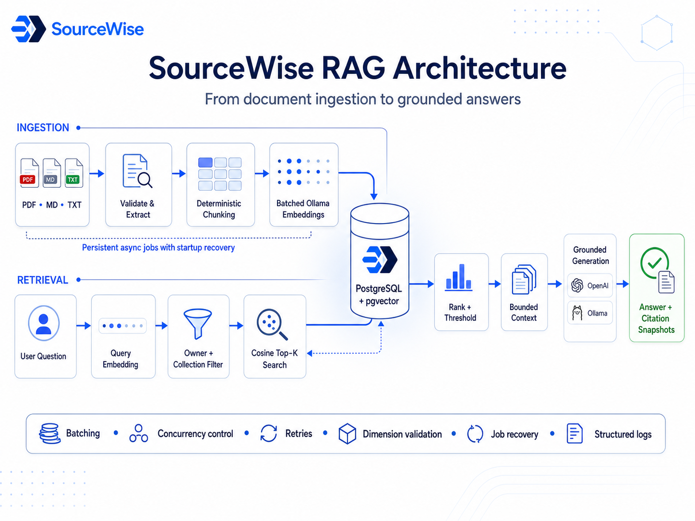

<div align="center">
  
  <h1>SourceWise</h1>
  <p><strong>Ask questions and get cited AI answers grounded in your own documents.</strong></p>
  <p>
    <a href="#quick-start">Quick start</a> ·
    <a href="./backend/README.md">Backend guide</a> ·
    <a href="./frontend/README.md">Frontend guide</a> ·
    <a href="http://localhost:8000/docs">API reference</a>
  </p>
</div>

SourceWise is a full-stack retrieval-augmented generation (RAG) application. Users can upload
documents, organize them into collections, ask questions against their content, and inspect the
citations behind each answer. The application combines a Next.js interface, a FastAPI service,
PostgreSQL with pgvector, and local Ollama models in a reproducible Docker Compose environment.

## Highlights

- **Grounded answers** — responses are generated from retrieved document chunks and include
  persisted citation snapshots.
- **Private workspaces** — authentication, documents, collections, questions, and history are
  scoped to the owning user.
- **Durable ingestion** — uploads are processed asynchronously with persisted job state and
  startup recovery.
- **Hybrid retrieval** — semantic similarity is combined with lexical evidence checks before
  context reaches the chat model.
- **Provider flexibility** — chat generation can use Ollama locally or an OpenAI-compatible
  provider; embeddings remain local through Ollama.
- **Production-shaped local stack** — health checks, one-shot database migrations, secrets,
  persistent volumes, and email capture are built into Compose.

## Architecture



The primary application flow is:

1. A verified user uploads a `.txt`, `.md`, or text-based `.pdf` document.
2. The API validates and stores the upload, then records a durable ingestion job.
3. In-process workers extract text, create overlapping chunks, request Ollama embeddings, and
   store vectors in PostgreSQL.
4. A question is embedded and matched against user-owned chunks with pgvector cosine search.
5. Retrieved candidates pass through lexical and semantic evidence checks before answer
   generation.
6. The answer and its exact citation snapshots are saved for later review.

## Technology

| Area | Technology |
| --- | --- |
| Web application | Next.js 16, React 19, TypeScript, Tailwind CSS, Radix UI |
| API | Python 3.13, FastAPI, Pydantic, SQLAlchemy asyncio |
| Database | PostgreSQL 16, pgvector, Alembic |
| AI | Ollama embeddings, Ollama or OpenAI-compatible chat generation |
| Tooling | `uv`, pnpm, Pytest, Vitest, Testing Library, ESLint, Ruff |
| Local platform | Docker Compose, Mailpit |

## Quick start

### Prerequisites

- Git
- Docker Engine or Docker Desktop with the Compose v2 plugin
- Enough memory and disk space to run PostgreSQL, the application containers, and local Ollama
  models

The Docker workflow is the recommended way to run the complete application. Native backend and
frontend workflows are documented in their respective guides.

### 1. Clone and configure

```bash
git clone https://github.com/IbrahimHerawi/sourcewise-ai.git
cd sourcewise-ai
cp .env.example .env
```

On PowerShell, replace the final command with:

```powershell
Copy-Item .env.example .env
```

The single root template contains the backend, frontend, and Compose settings required by the local
stack. It is configured for Docker networking and Ollama chat generation.

### 2. Create local secrets

Create these ignored files under `secrets/`:

| File | Purpose |
| --- | --- |
| `secrets/postgres_password.txt` | PostgreSQL password |
| `secrets/secret_key.txt` | JWT and token-signing secret; use at least 32 random characters |

With OpenSSL:

```bash
mkdir -p secrets
openssl rand -hex 24 > secrets/postgres_password.txt
openssl rand -hex 32 > secrets/secret_key.txt
```

Additional provider secrets are optional. See [`secrets/README.md`](secrets/README.md) for their
filenames and handling rules. Never commit secret values or put them directly in `.env`.

### 3. Start infrastructure and download models

```bash
docker compose up -d db ollama mailpit
docker compose exec ollama ollama pull nomic-embed-text
docker compose exec ollama ollama pull llama3.2:1b
```

Model downloads are persisted in the `ollama_data` volume and normally run only once per machine.
If you change `OLLAMA_EMBED_MODEL` or `OLLAMA_CHAT_MODEL` in `.env`, pull those model names instead.

> [!NOTE]
> The default `nomic-embed-text` embedding setup is deliberately CPU-compatible, so a dedicated GPU
> is not required to run SourceWise locally. On machines where Ollama performs embeddings on the
> CPU, ingestion is comparatively slow because every document chunk must be embedded before the
> document becomes ready. For the best local v1 experience, start with small or medium-sized files
> and avoid very large documents. Ollama can use supported GPU acceleration automatically when it
> is available.

### 4. Start SourceWise

```bash
docker compose up -d --build
docker compose ps
```

Compose waits for PostgreSQL, runs `alembic upgrade head` in the one-shot `migrate` service, and
starts the API only after migrations complete successfully. A separate manual migration command is
not required during normal startup.

Open [http://localhost:3000](http://localhost:3000), create an account, and use Mailpit to open the
verification email before signing in.

### Service URLs

| Service | URL | Notes |
| --- | --- | --- |
| SourceWise | [http://localhost:3000](http://localhost:3000) | Main web application |
| API | [http://localhost:8000](http://localhost:8000) | FastAPI service |
| Swagger UI | [http://localhost:8000/docs](http://localhost:8000/docs) | Interactive API reference |
| ReDoc | [http://localhost:8000/redoc](http://localhost:8000/redoc) | Alternative API reference |
| Mailpit | [http://localhost:8025](http://localhost:8025) | Local verification and reset emails |
| PostgreSQL | `localhost:5434` | Host port for database tools |

Ollama is available only inside the Compose network by default; the application reaches it through
the `ollama` service name.

## Common operations

Inspect status and logs:

```bash
docker compose ps
docker compose logs -f migrate api frontend
```

Rebuild after dependency or Dockerfile changes:

```bash
docker compose up -d --build
```

Stop the stack while preserving data:

```bash
docker compose down
```

Reset the database and downloaded Ollama models:

```bash
docker compose down -v
```

> [!WARNING]
> The `-v` command permanently removes the Compose-managed PostgreSQL and Ollama volumes. Uploaded
> files under `data/` are bind-mounted separately and are not removed by that command.

## Repository layout

```text
sourcewise-ai/
├── backend/             FastAPI service, migrations, and backend tests
├── frontend/            Next.js application and frontend tests
├── demo/                Sample documents for manual evaluation
├── secrets/             Ignored runtime secret files and handling guidance
├── data/                Ignored uploaded-file storage used by Compose
├── .env.example         Combined backend, frontend, and Compose configuration
├── docker-compose.yml   Complete local application stack
└── README.md            Product overview and local onboarding
```

## Detailed documentation

- [`backend/README.md`](backend/README.md) — API architecture, ingestion and RAG internals,
  configuration, migrations, and backend testing.
- [`frontend/README.md`](frontend/README.md) — application routes, UI architecture, API proxy,
  authentication lifecycle, and frontend testing.
- [`frontend/tests/README.md`](frontend/tests/README.md) — detailed frontend test ownership and
  placement rules.
- [`secrets/README.md`](secrets/README.md) — supported secret files and security expectations.
