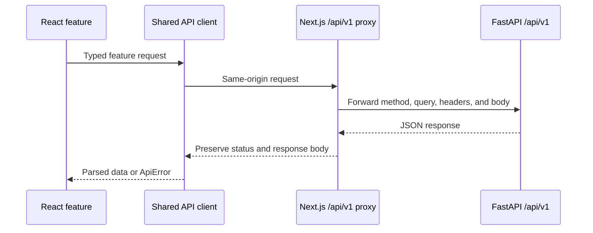

# SourceWise frontend

The SourceWise frontend is a responsive Next.js application for account onboarding, document and
collection management, grounded question answering, and citation-aware history. It uses the App
Router, feature-owned UI modules, and a same-origin server proxy for all backend communication.

[← Project overview](../README.md) · [Backend guide](../backend/README.md) ·
[Testing architecture](tests/README.md)

## Technology

- Next.js 16 with the App Router and standalone production output
- React 19 and strict TypeScript
- Tailwind CSS with feature-level CSS Modules
- Radix UI primitives and reusable shadcn-style components
- Framer Motion for intentional interface motion
- Vitest, Testing Library, jsdom, and axe-core
- ESLint with Next.js Core Web Vitals and TypeScript rules
- pnpm 11 managed through Corepack

## Application structure

```text
frontend/
├── public/                         Brand assets and product illustrations
├── src/
│   ├── app/                        App Router pages, layouts, metadata, and API proxy
│   ├── components/
│   │   └── ui/                     Shared low-level UI primitives
│   ├── contexts/                   Application-wide React providers
│   ├── features/
│   │   ├── auth/                   Account entry and password recovery UI
│   │   ├── collections/            Collection lists, details, dialogs, and data hooks
│   │   ├── dashboard/              Responsive shell, navigation, and pagination
│   │   ├── documents/              Upload, polling, library, and document dialogs
│   │   ├── landing/                Public marketing experience
│   │   ├── overview/               Authenticated resource summary
│   │   └── questions/              Asking, answers, citations, and history
│   ├── hooks/                      Cross-feature application hooks
│   └── lib/                        API client, contracts, formatting, colors, and utilities
├── tests/                           Shared test infrastructure and accessibility suites
├── package.json
└── pnpm-lock.yaml
```

Feature behavior stays close to its owner. Shared primitives belong in `src/components/ui`, while
cross-feature request and authentication behavior belongs in `src/lib` or `src/contexts`.

## Routes

| Route | Access | Purpose |
| --- | --- | --- |
| `/` | Public | Product landing page and account dialog entry points |
| `/sign-in` | Public | Dedicated sign-in page |
| `/sign-up` | Public | Dedicated registration page |
| `/verify-email` | Public | Consume an email verification token |
| `/reset-password` | Public | Consume a password-reset token |
| `/dashboard` | Authenticated | Resource overview |
| `/dashboard/documents` | Authenticated | Upload and manage all documents |
| `/dashboard/collections` | Authenticated | Create and manage collections |
| `/dashboard/collections/[collectionId]` | Authenticated | Collection-scoped documents, questions, and history |
| `/dashboard/ask-question` | Authenticated | Ask globally or within one collection |
| `/dashboard/history` | Authenticated | Review and delete saved answers and citations |

Routes under `/dev-preview` are internal UI preview surfaces, not primary product navigation.

## Request architecture

Browser code does not call the backend origin directly. The request path is:



This design gives the browser one stable `/api/v1` origin in development and production. The
catch-all route at `src/app/api/v1/[...path]/route.ts` resolves the backend using
`BACKEND_INTERNAL_URL`, removes transport-specific headers, disables caching, and returns a
normalized `503 backend_unavailable` response when the backend cannot be reached.

Feature modules wrap the shared client with domain-specific types and hooks:

- `features/documents` owns upload, list/detail/delete, processing polling, and file validation.
- `features/collections` owns collection CRUD and collection-scoped content.
- `features/questions` owns ask/history contracts, citation rendering, and related mutations.
- `features/overview` owns dashboard summary data.

## Authentication lifecycle

`AuthProvider` coordinates session restoration and protected navigation. The API client implements
the token protocol expected by the backend:

1. Login installs the complete token pair.
2. The access token stays in process memory and is added as a bearer token only to authenticated
   requests.
3. The rotating refresh token and its absolute expiration are persisted under
   `sourcewise_refresh_session` so a browser reload can restore the session.
4. Before an access token expires—or after an eligible `401`—the client performs one refresh and
   replaces both tokens.
5. The Web Locks API coordinates refresh work across tabs when the browser supports it.
6. An invalid, expired, replayed, or ambiguously consumed refresh token clears the session instead
   of retrying an unsafe rotation.
7. Logout asks the backend to revoke the token family and then clears browser state.

The frontend also removes legacy token storage during migration to the current session format.
Authentication responses and API requests use `cache: "no-store"`.

## Running the frontend

### Complete Docker stack

Use the [root quick start](../README.md#quick-start) to run the frontend with the complete SourceWise
stack. The production image:

- installs from the frozen pnpm lockfile;
- builds Next.js standalone output;
- copies only runtime assets into the final stage; and
- runs as the unprivileged `nextjs` user on port `3000`.

### Native development

Native frontend development requires Node.js 22 and Corepack. The backend must be reachable at the
URL configured below.

Create `frontend/.env.local` with the frontend-specific host values:

```dotenv
BACKEND_INTERNAL_URL=http://localhost:8000/api/v1
NEXT_PUBLIC_SITE_URL=http://localhost:3000
```

Then install dependencies and start the development server:

```bash
cd frontend
corepack enable
pnpm install --frozen-lockfile
pnpm dev
```

The development server is available at [http://localhost:3000](http://localhost:3000). The checked-in
`dev` script pipes output to `dev.log`; on a Windows shell without `tee`, run this equivalent command:

```powershell
pnpm exec next dev -p 3000
```

## Environment variables

The combined [root `.env.example`](../.env.example) is the source of truth for frontend, backend,
and Compose configuration. Docker Compose passes the root frontend values into the container. For
native development, keep only the frontend-specific host values in `frontend/.env.local`.

| Variable | Visibility | Default | Purpose |
| --- | --- | --- | --- |
| `BACKEND_INTERNAL_URL` | Server only | `http://localhost:8000/api/v1` | FastAPI target used by the Next.js proxy |
| `NEXT_PUBLIC_API_BASE_URL` | Browser-visible | `http://localhost:8000/api/v1` | Compatibility fallback when the internal proxy target is not set |
| `NEXT_PUBLIC_SITE_URL` | Browser-visible | `http://localhost:3000` | Canonical metadata, manifest, and social URL base |

`BACKEND_INTERNAL_URL` must include the backend `/api/v1` prefix and should not have a trailing
slash. In Compose it is `http://api:8000/api/v1`; from a native frontend it is normally
`http://localhost:8000/api/v1`.

Do not expose backend secrets through `NEXT_PUBLIC_*` variables. Those variables are embedded into
browser bundles at build time.

## UI architecture

### Shared shell and navigation

Dashboard navigation metadata is centralized in `features/dashboard/navigation.ts`. The desktop
sidebar, mobile navigation, shared header, route titles, contextual breadcrumbs, and parent-route
resolution derive from that single map. Collection detail preserves its originating list URL when
navigating back.

### Components and styling

- Shared primitive controls live in `src/components/ui` and should remain feature-agnostic.
- Feature components compose primitives and own product behavior.
- Tailwind utilities handle layout and design tokens; CSS Modules hold complex feature-specific
  states and responsive behavior.
- Global tokens, typography, and base styles live in `src/app/globals.css`.
- Brand assets belong in `public/brand`; product walkthrough images belong in
  `public/images/how-it-works`.

### Data and errors

- `src/lib/api.ts` owns transport, token attachment, refresh, parsing, and `ApiError`.
- Feature API modules own endpoint paths and wire types.
- Feature hooks own loading, polling, mutation, and view-facing state transitions.
- Backend error envelopes are converted into user-facing messages without leaking raw sensitive
  details.
- Processing views poll document state until it reaches `READY` or `FAILED`.

## Commands

Run these from `frontend/`:

| Command | Purpose |
| --- | --- |
| `pnpm dev` | Start the development server on port `3000` and write `dev.log` |
| `pnpm build` | Create the optimized standalone production build |
| `pnpm start` | Run an existing standalone build |
| `pnpm lint` | Run ESLint |
| `pnpm typecheck` | Run TypeScript without emitting files |
| `pnpm test` | Run the complete Vitest suite once |
| `pnpm test:unit` | Run feature unit suites |
| `pnpm test:components` | Run component suites |
| `pnpm test:integration` | Run multi-module feature suites |
| `pnpm test:pages` | Run page and route-state suites |
| `pnpm test:accessibility` | Run dedicated axe accessibility suites |
| `pnpm test:coverage` | Generate V8 text, HTML, LCOV, and JSON coverage reports |

Before merging frontend changes, run:

```bash
pnpm lint
pnpm typecheck
pnpm test
pnpm build
```

## Testing architecture

Tests use Vitest with jsdom and Testing Library. Feature-owned behavior is colocated under
`src/features/<feature>/__tests__`, divided into `unit`, `components`, `integration`, and `pages`.
Cross-feature accessibility suites and reusable render/setup helpers live under top-level `tests/`.

Path aliases are available in code and tests:

- `@/*` resolves to `src/*`.
- `@test/*` resolves to `tests/*`.
- Production modules are forbidden from importing `@test/*`; ESLint enforces the boundary.

Browser E2E tests are intentionally excluded from Vitest, and no E2E runner is configured in v1.
See [`tests/README.md`](tests/README.md) for detailed ownership and placement rules.

## Troubleshooting

### The UI reports that the backend is unavailable

Confirm the backend health endpoint and the proxy target:

```bash
curl http://localhost:8000/api/v1/health
```

For native development, verify `BACKEND_INTERNAL_URL` in `.env.local`. For Docker, inspect
`docker compose logs api frontend` from the repository root.

### A restored session immediately signs out

The refresh token may be expired, invalid, already consumed, or revoked by logout/password reset.
Signing in again creates a new refresh-token family. Avoid manually copying token state between
browsers or tabs.

### A document never becomes ready

The frontend only presents backend processing state. Inspect API and Ollama logs, confirm both
configured models are installed, and review the document's `error_message` through the details UI
or API.

### The production build fails while loading fonts

The root layout uses `next/font/google`; the build environment must be able to download those font
assets. Re-run the build with working network access or deliberately replace the font strategy.
